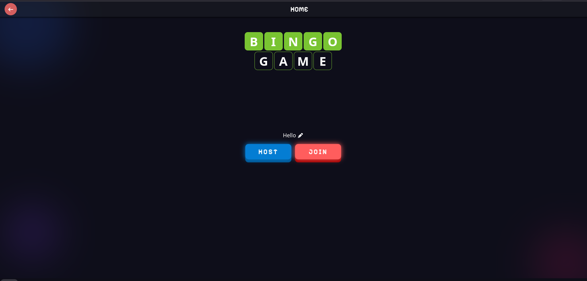
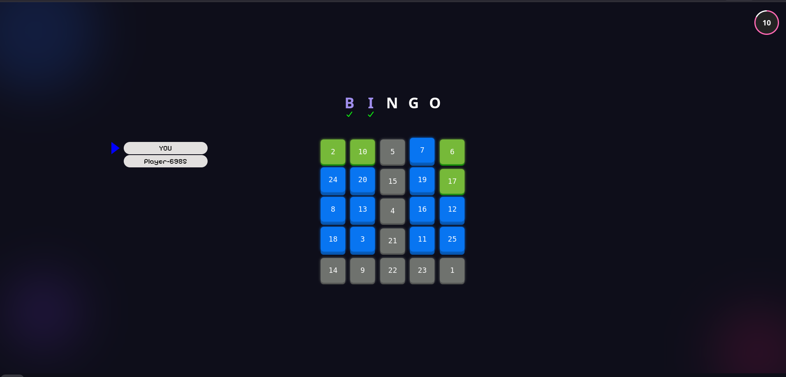

# 🎯 Bingo Game

A real-time multiplayer Bingo game built using modern web technologies. Players can join a room, mark numbers, and compete to complete Bingo patterns faster than others.

---

## 🚀 Features

- 🎮 Real-time multiplayer gameplay
- 🔢 Auto-generated Bingo grid
- ⚡ Fast number marking with sync across players
- 🌐 WebSocket-based communication
- 🏆 Winner detection system
- 📱 Responsive UI

---

## 🛠️ Tech Stack

### Frontend
- React.js
- Redux Toolkit
- TypeScript

### Backend
- Node.js
- Express.js
- Socket.IO (WebSockets)

---

## 📸 Screenshots

> Make sure these images exist in your root directory or update paths accordingly.

### 🏠 Home Screen


### 🎮 Game Board



---

## ⚙️ Installation & Setup

### 1. Clone the repository

```bash
git clone https://github.com/syther-z/Bingo-Game.git
cd Bingo-Game
